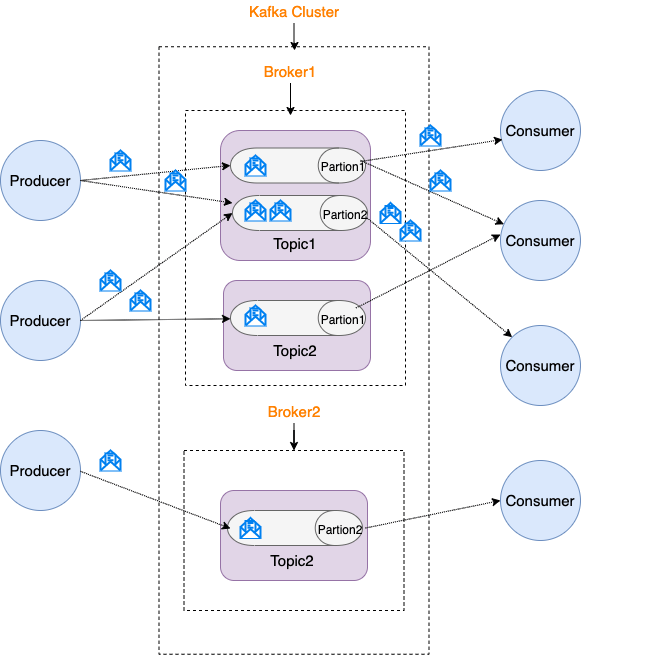

# Spring kafka

* Kafka 将记录流（流数据）存储在 topic 中。
* 每个记录由一个键、一个值、一个时间戳组成。



* Producer（生产者） : 产生消息的一方。
* Consumer（消费者） : 消费消息的一方。
* Broker（代理） : 可以看作是一个独立的 Kafka 实例。多个 Kafka Broker 组成一个 Kafka Cluster。
* Topic（主题） : Producer 将消息发送到特定的主题，Consumer 通过订阅特定的 Topic(主题) 来消费消息。
* Partition（分区） : Partition 属于 Topic 的一部分。一个 Topic 可以有多个 Partition ，并且同一 Topic 下的 Partition 可以分布在不同的 Broker 上，这也就表明一个 
  Topic 可以横跨多个 Broker 。
* Kafka 为分区（Partition）引入了多副本（Replica）机制。分区（Partition）中的多个副本之间会有一个叫做 leader 的家伙，其他副本称为 follower。我们发送的消息会被发送到 leader 
  副本，然后 follower 副本才能从 leader 副本中拉取消息进行同步。

## ZooKeeper
ZooKeeper 主要为 Kafka 提供元数据的管理的功能。
* Broker 注册 ：在 Zookeeper 上会有一个专门用来进行 Broker 服务器列表记录的节点。每个 Broker 在启动时，都会到 Zookeeper 上进行注册，即到/brokers/ids 
  下创建属于自己的节点。每个 Broker 就会将自己的 IP 地址和端口等信息记录到该节点中去。
* Topic 注册 ： 在 Kafka 中，同一个Topic 的消息会被分成多个分区并将其分布在多个 Broker 上，这些分区信息及与Broker的对应关系也都是由 Zookeeper在维护。比如我创建了一个名字为 
  my-topic 的主题并且它有两个分区，对应到 zookeeper 中会创建这些文件夹：/brokers/topics/my-topic/Partitions/0、/brokers/topics/my-topic
  /Partitions/1。
* 负载均衡 ：上面也说过了 Kafka 通过给特定 Topic 指定多个 Partition, 而各个 Partition 可以分布在不同的 Broker 上, 这样便能提供比较好的并发能力。 对于同一个 Topic 的不同 
  Partition，Kafka 会尽力将这些 Partition 分布到不同的 Broker 服务器上。当生产者产生消息后也会尽量投递到不同 Broker 的 Partition 里面。当 Consumer 
  消费的时候，Zookeeper 可以根据当前的 Partition 数量以及 Consumer 数量来实现动态负载均衡。

## Docker安装kafka

```shell
// 下载镜像
docker pull wurstmeister/zookeeper  
docker pull wurstmeister/kafka 

// 启动镜像
docker run -d --name zookeeper --publish 2181:2181 --volume /etc/localtime:/etc/localtime zookeeper:latest

docker run -d --name kafka --publish 9092:9092 --link zookeeper --env KAFKA_ZOOKEEPER_CONNECT=zookeeper:2181 --env KAFKA_ADVERTISED_HOST_NAME=192.168.31.194 --env KAFKA_ADVERTISED_PORT=9092 --volume /etc/localtime:/etc/localtime wurstmeister/kafka:latest

// 测试
docker exec -it ${CONTAINER ID} /bin/bash   

cd opt/kafka_2.11-0.10.1.1/   

bin/kafka-topics.sh --create --zookeeper zookeeper:2181 --replication-factor 1 --partitions 1 --topic mykafka  

// 运行一个消息生产者，指定topic为刚刚创建的主题
bin/kafka-console-producer.sh --broker-list localhost:9092 --topic mykafka  

// 运行一个消费者，指定同样的主题
bin/kafka-console-consumer.sh --zookeeper zookeeper:2181 --topic mykafka --from-beginning

'''
